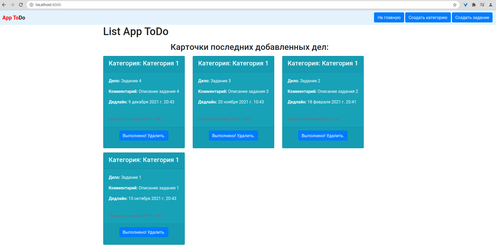
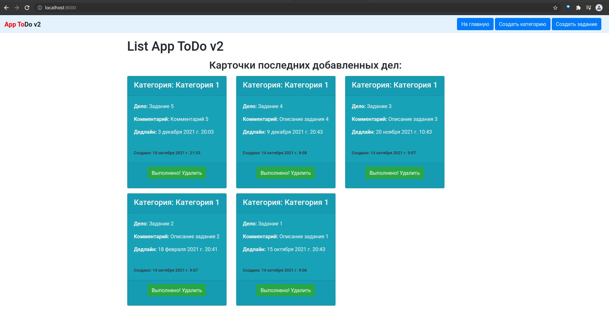

# app_todo_v2

#### Django 3.1.6
#### Pillow 8.3.2

## install
```git clone https://github.com/ilyukevich/app_todo_v2.git```

```pip install -r requirements.txt```

```python manage.py makemigrations```

```python manage.py migrate```

```python manage.py createsuperuser```

```python manage.py runserver```

## access
```http://localhost:8000/ ```

```http://localhost:8000/admin```

## screen


